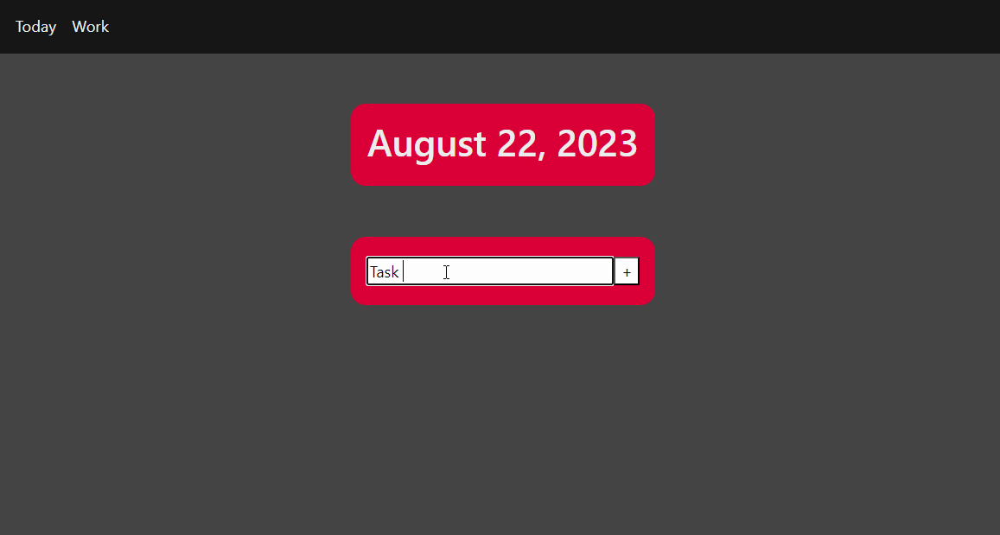

# TodoList

[Test it out!](https://todolist-rn4b.onrender.com/)

## Features

- Developed a dynamic and user-friendly full stack to-do list web application utilizing HTML, CSS, EJS, Node.js,
and Express.js
- Enabled task addition via HTML forms, seamlessly updating the task list through backend integration
- Enhanced user experience by employing CSS styling to provide clear visual cues upon task completion
- Designed and implemented a responsive Bootstrap Navbar, ensuring a consistent and intuitive UI across various
devices, including mobile devices

## Video Walkthrough

